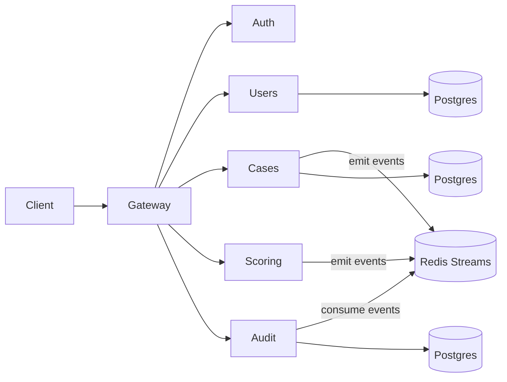
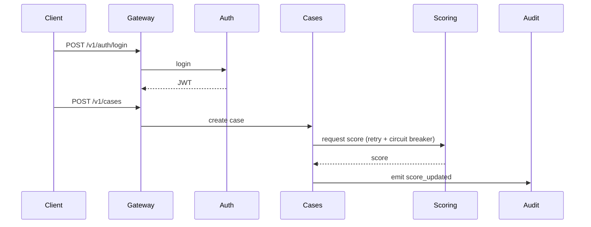

# microservices-reference-platform

A production-grade Python microservices reference platform built for demonstration purposes. It provides clear service boundaries, an edge gateway, JWT-based auth with RBAC, schema/versioning strategy, resilience patterns, observability stack, and CI workflows.

## Number of services: 6

| Service | Responsibility | Data Store | Async Events |
| --- | --- | --- | --- |
| gateway | Edge gateway, JWT enforcement, rate limiting, request IDs | None | None |
| auth-service | OAuth2 password flow, JWT issuance | None | None |
| user-service | CRUD users | Postgres (user-db) | Emits user updates (future) |
| case-service | CRUD cases, scoring orchestration | Postgres (case-db) | Emits case/score events |
| scoring-service | Mock ML scoring | None | Publishes score_updated |
| audit-telemetry-service | Audit log + query | Postgres (audit-db) | Consumes case/score events |

## Architecture





## Gateway routes

- `/v1/auth/*` -> auth-service
- `/v1/users/*` -> user-service
- `/v1/cases/*` -> case-service
- `/v1/scoring/*` -> scoring-service
- `/v1/audit/*` -> audit-telemetry-service

Gateway enforces JWTs for all routes except `/v1/auth/login`, applies rate limiting, and propagates `X-Request-Id`.

## Auth model

- OAuth2 password flow issuing JWTs (short expiry).
- Roles embedded in JWT claims: `admin`, `analyst`, `viewer`.
- RBAC enforced at service layer (admin can create users, analyst can create cases, viewer read-only).

## Schema + versioning strategy

- OpenAPI generated per service.
- JSON Schema contracts stored in `libs/schemas`.
- Case service introduces `/v2/cases` with a new `priority` field while `/v1` remains intact.

## Resilience strategy

- Case-service calls scoring-service with timeouts, retries (exponential backoff + jitter), circuit breaker, and bulkhead.
- Idempotency keys supported on case creation.
- If scoring fails, case is marked `PENDING_SCORE` and emits a `score_pending` event for later retry.

## Observability stack

- Structured JSON logs include `service_name`, `request_id`, and `trace_id`.
- OpenTelemetry traces to Jaeger.
- Prometheus metrics on `/metrics` for each service.
- Grafana dashboard JSON included in `grafana/dashboards`.

SLO indicators (example):
- p95 latency: Prometheus `histogram_quantile(0.95, sum(rate(http_request_duration_seconds_bucket[5m])) by (le))`
- error rate: `sum(rate(http_requests_total{status_code=~"5.."}[5m]))`
- saturation: `process_cpu_seconds_total` (per service)

## Local development

```bash
make up
```

### Example flow

```bash
# Login
curl -X POST http://localhost:8080/v1/auth/login \
  -d "username=admin@example.com&password=admin123"

# Use access_token from response
export TOKEN=<access_token>

# Create user (admin)
curl -X POST http://localhost:8080/v1/users \
  -H "Authorization: Bearer $TOKEN" \
  -H "Content-Type: application/json" \
  -d '{"email":"new@example.com","role":"viewer","full_name":"New User"}'

# Create case (analyst)
curl -X POST http://localhost:8080/v1/cases \
  -H "Authorization: Bearer $TOKEN" \
  -H "Idempotency-Key: case-001" \
  -H "Content-Type: application/json" \
  -d '{"title":"Investigate","owner_id":"<user-uuid>","priority":"high"}'

# Query audit log
curl -X GET http://localhost:8080/v1/audit \
  -H "Authorization: Bearer $TOKEN"
```

### Observability

- Jaeger: http://localhost:16686
- Prometheus: http://localhost:9090
- Grafana: http://localhost:3000 (admin/admin)

## Testing

```bash
make test
make lint
make format
make typecheck
```

## Deployability

- `docker-compose.yml` for local dev with all services, databases, and observability stack.
- Multi-stage Dockerfiles for each service (non-root user).
- Optional k8s manifests under `/deploy/k8s`.
- Alembic migration scaffolding per data service.

## CI/CD

- `workflows/ci.yml`: lint + typecheck + unit/integration tests + build images
- `workflows/security.yml`: pip-audit, bandit, trivy, SBOM via syft

## Repository layout

```
libs/
  platform_lib/   # shared logging/auth/tracing
  schemas/        # JSON Schema contracts
services/
  gateway/
  auth-service/
  user-service/
  case-service/
  scoring-service/
  audit-telemetry-service/
```

## Runbook

See `docs/runbook.md` for local debug steps and common failure modes.

## Screenshots

To capture Grafana dashboards, run:
```bash
open http://localhost:3000
```
